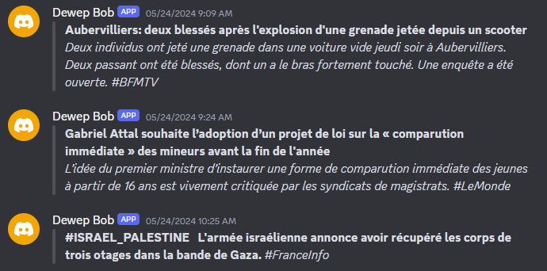

# News-Alerts-Discord

Send news live direct alerts to a Discord channel

- LeMonde https://www.lemonde.fr/actualite-en-continu/
- BFM TV https://www.bfmtv.com/
- FranceTV Info https://www.francetvinfo.fr/en-direct/



## Discord BOT

- Create a Discord Application: https://discord.com/developers/applications
- Generate a Bot for this application (use the token for the DISCORD_BOT_AUTHORIZATION env variable)
- Add your bot to your Discord server: https://discord.com/oauth2/authorize?client_id=xxxx&scope=bot&permissions=2048 (xxxx is your app ID)
- The Discord Channel ID is the second part of the URL: https://discord.com/channels/xxxx/yyyy (yyyy here)

## Usage

For the first run, exec `zx --install main.mjs` to install dependencies.

```bash
DISCORD_CHANNEL_ID=123456789 DISCORD_BOT_AUTHORIZATION=xxx.yyy.zzz zx main.mjs
```

## Docker

```
git pull
docker compose stop
docker compose rm
docker compose build
docker compose up -d
```
